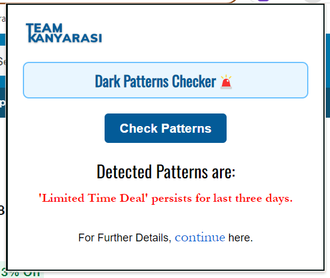

# 🕵️‍♂️ Dark Patterns Detector Extension

## 🚀 Overview

The **Dark Patterns Detector** is a browser extension designed to identify and flag manipulative user interface designs, known as dark patterns. This project was developed as part of the **Dark Patterns Buster Hackathon** organized by the Ministry of Consumer Affairs, where it successfully reached the finals.

## ✨ Key Features

- **Detection Algorithms**: Identifies common dark patterns like deceptive design, misdirection, and forced continuity.
- **Web Scraping**: Utilizes **Beautiful Soup** to parse and analyze web pages in real-time.
- **Flask Backend**: Manages data processing and integration with the browser extension.

## 🖼️ Screenshots

Here are a couple of examples of the extension in action:

## 🛠️ Tech Stack

- **Python 3.8+**
- **Flask 2.0+**
- **Beautiful Soup**

## 🌟 Highlights

- **Hackathon Finalist**: Reached the finals in the Dark Patterns Buster Hackathon for its innovative approach to detecting dark patterns.
- **Team Collaboration**: Led a team to build and refine the extension, ensuring it met high standards.

## 🤝 Contributions

Contributions are welcome! Feel free to fork the repository, create a branch, and submit a pull request.

## 📧 Contact

For any inquiries or collaboration opportunities, reach out via [email](mailto:udayteja2003@gmail.com) or connect on [LinkedIn](https://www.linkedin.com/in/uday-teja-koruttoru-462241263/).

---

Make the web a safer place, one extension at a time! 🌐
